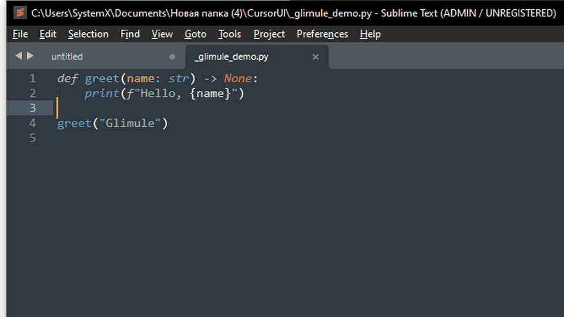

# Glimule

## macOS-style keyboard layout and Caps Lock HUD for Windows



On macOS Sonoma and Tahoe, switching the keyboard layout or Caps Lock shows a small capsule next to the text caret. Glimule brings that same mechanic to Windows.

The capsule appears only in real text fields, follows the caret across monitors, and does not replace the system caret or Windows input controls. Layouts are labeled the macOS way: English as **A**, Russian as **РУ**, and other languages in native script or ISO code. The app runs from the tray; settings stay in English regardless of the system language.

## macOS-inspired experience

Glimule is designed as a Windows implementation of the input HUD familiar from macOS Sonoma and Tahoe:

- a compact, rounded capsule is anchored directly beside the text caret;
- the active keyboard layout uses the same concise visual language, such as **A** and **РУ**;
- layout changes use a sliding selection accent and a short pop-in animation;
- the Caps Lock indicator uses a separate blue accent and appears without interrupting typing;
- the overlay is shown only while editing text, instead of being fixed to a screen corner;
- the dark translucent surface, generous corner radius, centered glyphs, and restrained animation follow the same visual principles as the macOS interface.

This is an independent Windows utility inspired by that interaction pattern. It does not include Apple code or replace Windows' native input system.

## Features

- Shows the current keyboard layout next to the caret
- Displays the Caps Lock state with a dedicated indicator
- Smooth animated transitions when switching layouts
- Supports text fields in desktop applications, browsers, Word, and Excel
- Per-monitor DPI support
- Adjustable indicator scale from 50% to 200%
- Optional Windows startup launch
- Runs quietly from the notification area

## Installation

Download `Glimule.exe` from [Releases](https://github.com/xtxrx774/Glimule/releases) and run it.

Glimule requires Windows 10 or later (64-bit).

## Build

The project uses WPF and WinForms on .NET 8:

```powershell
dotnet build -c Release
```

The executable is written to `bin\Release\net8.0-windows\Glimule.exe`.

## Usage

Launch `Glimule.exe`. The application runs in the notification area. Open the tray menu to change the scale, configure startup, open settings, or exit.
